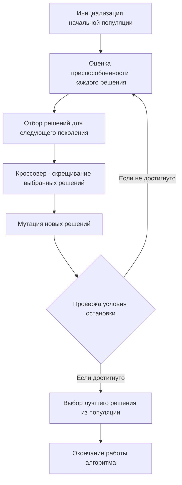

# Задание №23
## Задача о рюкзаке, генетический алгоритм
1. В файле knapsack_problem/genetic_solver.py необходимо реализовать метод *get_knapsack* класса *GeneticSolver* для поиска набора вещей рюкзака максимальной стоимости с применением генетического алгоритма.
2. Для получения повышенной оценки можно дополнительно реализовать:
- Остановку алгоритма по несменяемости лидера.
- Выбор особей для скрещивания турниром или рулеткой.
- Равномерное скрещивание.
## Примечания
- **Тесты должны выполняться на сервере не более 5 минут.** 
- Обратить внимание, что некоторые тесты ожидают вызов определенного вида исключения с заданным сообщением об ошибке.  
- Разработку вести в отдельной ветке, созданной на основе данной. В названии ветки префикс main заменить на название команды.  
- Корректность работы класса *GeneticSolver* проверить запустив файл test/test_genetic_solver.py с модульными тестами. 

## Постановка задачи о рюкзаке
Задача о рюкзаке (англ. Knapsack problem) — дано N предметов, ni предмет имеет массу wi > 0 и стоимость pi > 0. Необходимо выбрать из этих предметов такой набор, чтобы суммарная масса не превосходила заданной величины W (вместимость рюкзака), а суммарная стоимость была максимальна.

### Оценка сложности задачи о рюкзаке
Задача о рюкзаке является NP-полной задачей. Это означает, что не существует известного алгоритма, который мог бы решить эту задачу за полиномиальное время.

Полный перебор для решения задачи о рюкзаке имеет экспоненциальную сложность. Это связано с тем, что для каждого предмета есть два варианта - включить его в рюкзак или нет. Таким образом, для n предметов количество возможных комбинаций будет 2n, что делает полный перебор непрактичным для больших значений n.

Метод ветвей и границ может значительно сократить количество рассматриваемых решений по сравнению с полным перебором, он все равно может быть довольно затратным в плане времени и памяти, особенно для больших задач. В худшем случае метод ветвей и границ может привести к полному перебору всех возможных комбинаций, что дает экспоненциальную сложность O(2n), где n - количество предметов. Это происходит, когда невозможно отсечь ни одну ветвь и приходится исследовать все возможные подмножества предметов.

# Генетический алгоритм
Генетический алгоритм — это метод оптимизации и поиска решений, который использует принципы генетики и естественного отбора. Он может быть использован для нахождения приближенного решения задач, для которых нет эффективного алгоритма, в том числе для задачи о рюкзаке и задачи коммивояжера.

Основные шаги генетического алгоритма:
- Инициализация: Создается начальная популяция случайных решений (особей).
- Оценка: Каждое решение оценивается с помощью функции приспособленности (фитнес функция), которая измеряет качество решения.
- Отбор: На основе оценки приспособленности выбираются решения, которые будут использоваться для создания нового поколения. Чем выше приспособленность, тем больше шансов у решения быть выбранным.
- Кроссовер (скрещивание): Выбранные решения комбинируются для создания новых решений. Это может происходить различными способами, но обычно включает в себя обмен частями двух решений.
- Мутация: С небольшой вероятностью некоторые части новых решений случайным образом изменяются для добавления вариативности.
- Новое поколение: Новые решения заменяют старые, и процесс повторяется с шага оценки.

Этот процесс продолжается до тех пор, пока не будет достигнут критерий остановки, например, максимальное количество поколений или достижение достаточно хорошего решения.

