# Алгоритм пирамидальной сортировки

## Описание алгоритма

**Пирамидальная сортировка (сортировка кучей)** - эффективный алгоритм упорядочивания элементов, разработанный
Джоном Вильясом в 1964 году. Алгоритм основан на использовании бинарной кучи (heap), представляющей собой бинарное дерево.

Благодаря использованию бинарной кучи, пирамидальная сортировка обладает асимптотической временной сложностью O(n log n) в среднем и 
худшем случаях. Еще одним преимуществом этой сортировки является то, что она может выполняться "на месте", без дополнительных затрат памяти.

Алгоритм построен на принципе извлечения максимального (минималього) элемента из кучи и упорядочивания оставшихся элементов. Состоит из двух
этапов:

1. Построение кучи (heapify): На этом этапе строится куча из исходных данных. Для каждой вершины в куче выполняется свойство
 упорядоченности: значение в родительском узле больше (равно) значений(ям) в дочерних узлах.
2. Извлечение max/min и перестроение: После построения кучи извлекается максимальный элемент из корня, а куча перестраивается (элементы просеиваются).

### Входные данные:

Список (list).

### Выходные данные:

Отсортированный исходный список (list).

### Области допустимых значений:

• Список должен содержать однотипные элементы, которые поддерживают сравнение. Это могут быть:

- Числа (int, float);
- Строки (str);
- Пользовательские типы с определенными методами сравнения (lt, le, gt, ge).

• Список может быть пустым (в таком случае он считается отсортированным).

## Описание алгоритма

Допустим, дан список [1, 4, 3, 8, 9 ,4, 0]. Необходимо произвести сортировку на месте.

### 1. Построение бинарной кучи
1.1 Составим бинарное дерево из элементов списка. 

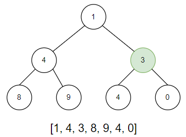

Теперь нужно проверить соблюдение основного свойства кучи у каждого родителя. Если оно не соблюдается - произвести просеивание.

Начинаем проверку с 3, т.к. именно здесь может быть нарушено свойство кучи. И действительно: 3 < 4.

1.2 Обмениваем значения 3 и 4 местами и переходим к следующему родителю.

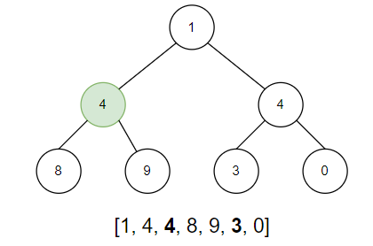

Аналогичная ситуация: 4 гораздо меньше 9, следовательно просеиваем 9 вверх на место 4.

1.3 Наконец, мы достигли корневой вершины. В ней тоже нарушается свойство, поэтому обмениваем элементы 9 и 1.

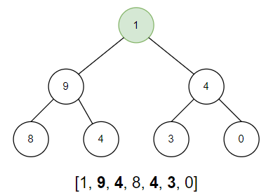

НО! Из-за проведенного просеивания у нас нарушилось свойство кучи в левом родителе.

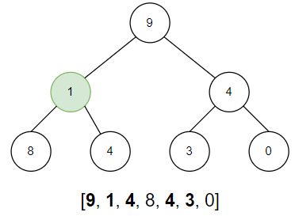

Поэтому нужно вернуться вниз и восстановить свойство, обменяв элементы 1 и 8 местами.

Готово! Бинарная куча успешно построена!

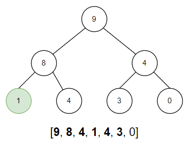

### 2. Сортировка

Для сортировки нужно взять последний элемент списка в качестве текущего, обменять с первым элементом местами
и провести просеивание вниз. При этом максимальный элемент остается в конце массива и больше не учитывается при работе с кучей.

2.1 Поменяем максимальный и минимальный элементы местами.

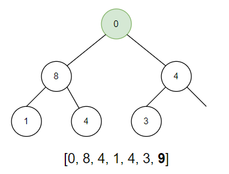

2.2 Просеим элемент 0 вниз.

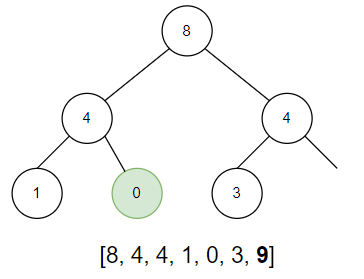

2.3 Повторим процедуру: поменяем элементы 3 и 8 местами.

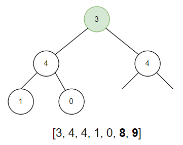

2.4 Просеим элемент 3 вниз. Т.к. оба потомка равны, можем просеить 3 в любую ветку. Пусть это будет правая ветка.

2.5 На рисунках ниже приведены аналогичные действия

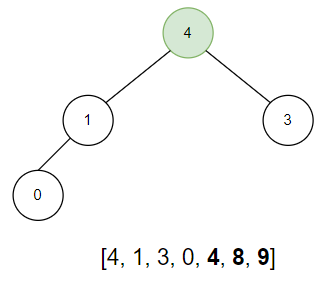

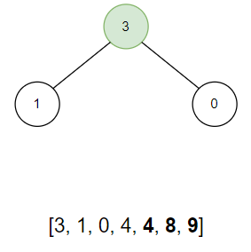

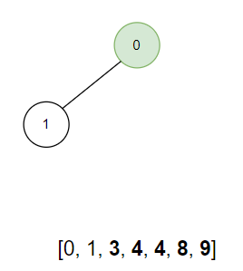

### Список успешно отсортирован!