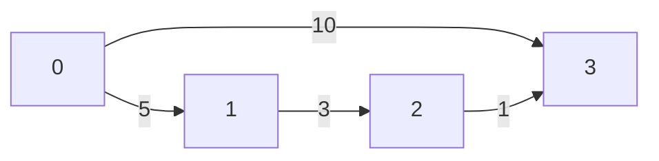

# Алгоритм Флойда–Уоршелла

## Описание алгоритма
Алгоритм Флойда–Уоршелла — это алгоритм поиска кратчайших путей между всеми парами вершин в графе с весами ребер. 
Он работает для графов с как положительными, так и отрицательными весами ребер, 
но не подходит для графов с циклами отрицательной длины.
(поскольку в этом случае кратчайший путь может не существовать)
### Входные данные:
Матрица смежности графа, где a[i][j] — вес ребра между вершиной i и вершиной j, если такое ребро существует, 
или бесконечность, если ребра нет.
### Выходные данные:
Матрица кратчайших путей, где d[i][j] — длина кратчайшего пути между вершиной i и вершиной j.
### Области допустимых значений:
Веса ребер могут быть как положительными, так и отрицательными, но не должны содержать циклов отрицательной длины.
## Пример выполнения алгоритма
### Данные на входе
 Граф:

Матрица смежности: 

|       | **0** | **1** | **2** | **3** |
|:------|:-----:|:-----:|:-----:|:-----:|
| **0** |   0   |   5   | **∞** |  10   |
| **1** | **∞** |   0   |   3   | **∞** |
| **2** | **∞** | **∞** |   0   |   1   |
| **3** | **∞** | **∞** | **∞** |   0   |

### Решение

Для каждой вершины построим матрицу, где будем находить минимальное расстояние между вершинами из прямого пути между ними и путь через выбранную вершину

Формула для вершины 0:
a - начальная вершина
b - конечная вершина
matrix_init - начальная матрица
matrix_0 - матрица с минимальными расстояниями, если мы проходим через 0 вершину
matrix_0[a][b] = min(matrix_init[a,b], matrix_init[a][0] + matrix_init[0][b])

После выполнения алгоритма для вершины 0 matrix_init заменяется на matrix_0 и мы ищем уже matrix_1 для первой вершины.
Выполняем алгоритм для всех вершин.

#### Matrix_0

|       | **0** | **1** | **2** | **3** |
|:------|:-----:|:-----:|:-----:|:-----:|
| **0** |   0   |   5   | **∞** |  10   |
| **1** | **∞** |   0   |   3   | **∞** |
| **2** | **∞** | **∞** |   0   |   1   |
| **3** | **∞** | **∞** | **∞** |   0   |

#### Matrix_1

|       | **0** | **1** | **2** | **3** |
|:------|:-----:|:-----:|:-----:|:-----:|
| **0** |   0   |   5   |   8   |  10   |
| **1** | **∞** |   0   |   3   | **∞** |
| **2** | **∞** | **∞** |   0   |   1   |
| **3** | **∞** | **∞** | **∞** |   0   |

#### Matrix_2

|       | **0** | **1** | **2** | **3** |
|:------|:-----:|:-----:|:-----:|:-----:|
| **0** |   0   |   5   |   8   |   9   |
| **1** | **∞** |   0   |   3   |   4   |
| **2** | **∞** | **∞** |   0   |   1   |
| **3** | **∞** | **∞** | **∞** |   0   |

#### Matrix_3

|       | **0** | **1** | **2** | **3** |
|:------|:-----:|:-----:|:-----:|:-----:|
| **0** |   0   |   5   |   8   |   9   |
| **1** | **∞** |   0   |   3   |   4   |
| **2** | **∞** | **∞** |   0   |   1   |
| **3** | **∞** | **∞** | **∞** |   0   |