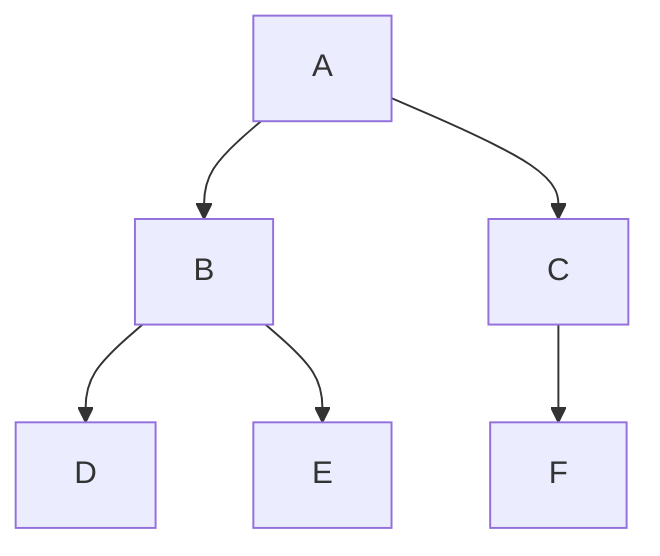

# Алгоритм обхода графа в ширину
Алгоритм обхода графа в ширину используется для поиска в графах и деревьях. Этот алгоритм начинает с 
корневого узла и исследует все узлы на текущем уровне перед переходом к узлам на следующем уровне. 
Для реализации данного алгоритма обычно используется очередь.

## Описание алгоритма
### Инициализация 
Начнем с какого-то начального узла (стартового узла). Добавим его в очередь и отметим как посещенный.
### Обработка, пока очередь не пуста
Извлечем узел из очереди.
Обработаем этот узел (например, выведем его или запомним его значение).
Добавим в очередь все непосещенные соседние узлы текущего узла и отметим их как посещенные.
### Повторение 
Продолжаем процесс, пока очередь не станет пустой.
Пример применения BFS
Рассмотрим граф, представленный в виде списка смежности:

### Смежные вершины:
A: [B, C]  
B: [A, D, E]  
C: [A, F]  
D: [B]  
E: [B]  
F: [C]

## Шаги выполнения алгоритма

### Инициализация

Начальный узел: A  
Очередь: A  
Посещенные узлы: A  

### Первый цикл
Очередь: пустая  
Извлеченный узел: A  
Обработка: A  
Соседи A: B, C  
Очередь: B, C  
Посещенные узлы: A, B, C

### Второй цикл
Очередь: C  
Извлеченный узел: B  
Обработка: B  
Соседи B: A, D, E (A уже посещен)  
Очередь: C, D, E  
Посещенные узлы: A, B, C, D, E  

### Третий цикл
Очередь: D, E  
Извлеченный узел: C  
Обработка: C  
Соседи C: A, F (A уже посещен)  
Очередь: D, E, F  
Посещенные узлы: A, B, C, D, E, F  

### Четвертый цикл
Очередь: E, F  
Извлеченный узел: D  
Обработка: D  
Соседи D: B (B уже посещен)  
Очередь: E, F  
Посещенные узлы: A, B, C, D, E, F

### Пятый цикл
Очередь: F  
Извлеченный узел: E  
Обработка: E  
Соседи E: B (B уже посещен)  
Очередь: F  
Посещенные узлы: A, B, C, D, E, F

### Шестой цикл
Очередь: пустая  
Извлеченный узел: F  
Обработка: F  
Соседи F: C (C уже посещен)  
Очередь: пустая  
Посещенные узлы: A, B, C, D, E, F  

## Итог
Очередь пуста, алгоритм завершен. Все узлы графа посещены в порядке: A, B, C, D, E, F.

