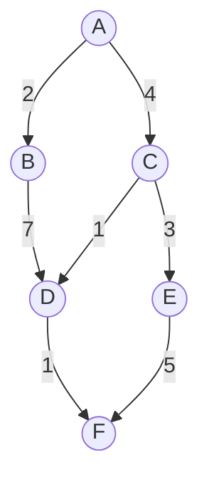

# Алгоритм A\*

## Описание алгоритма

A* — это алгоритм поиска, который объединяет преимущества жадного подхода и поиска с оценкой стоимости. Он использует эвристическую функцию, чтобы оценивать стоимость оставшегося пути до целевого узла, и фактическую стоимость уже пройденного пути, чтобы минимизировать общую стоимость пути.

### Связанные и расширенные версии

1. **Алгоритм Дейкстры (Dijkstra’s Algorithm)**
2. **Алгоритм жадного поиска по первому наилучшему совпадению (Greedy Best-First Search)**
3. **Weighted A\***
4. **Iterative Deepening A\* (IDA\*)**
5. **Jump Point Search (JPS)**

## Входные данные:

1. **Граф \( G \)** - набор узлов \( N \) и рёбер \( E \) с весами \( w \)
2. **Начальный узел \( s \)**, от которого начинается поиск
3. **Целевой узел \( t \)**, к которому необходимо найти путь
4. **Эвристическая функция \( h(n) \)**. Оценивает оставшуюся стоимость от узла \( n \) до целевого узла \( t \)

## Выходные данные:

1. **Путь \( P \)** - последовательность узлов, ведущая от начального узла \( s \) к целевому узлу \( t \).
2. **Общая стоимость пути** - сумма весов рёбер на найденном пути.

## Области допустимых значений:

- **Граф** может быть представлен в виде матрицы смежности или списка смежности.
- **Эвристическая функция** должна быть допустимой (никогда не переоценивать оставшуюся стоимость).

## Пошаговый пример выполнения алгоритма

### Условия задачи:

- **Граф**: Узлы \( \{A, B, C, D, E, F\} \), рёбра с весами:

  | Рёбра | Вес |
  |-------|-----|
  | A → B | 2   |
  | A → C | 4   |
  | B → D | 7   |
  | C → E | 3   |
  | C → D | 1   |
  | D → F | 1   |
  | E → F | 5   |

- **Начальный узел**: \( A \)
- **Целевой узел**: \( F \)
- **Эвристическая функция**:

  | Узел | Эвристика |
  |------|------------|
  | \( h(A) \) | 7 |
  | \( h(B) \) | 6 |
  | \( h(C) \) | 2 |
  | \( h(D) \) | 1 |
  | \( h(E) \) | 5 |
  | \( h(F) \) | 0 |

### Визуальное представление графа:

### Пошаговое выполнение алгоритма A*

#### Инициализация
- **Открытый список**: [A (0 + 7)]
- **Закрытый список**: []

#### Шаг 1: Выбираем узел A
- **Открытый список**: [A]
- **Закрытый список**: []

#### Шаг 2: Раскрываем узел A
- Соседи A: B (2), C (4)
- Обновляем стоимости: g(B) = 2, g(C) = 4
- **Открытый список**: [B (2 + 6), C (4 + 2)]
- **Закрытый список**: [A]

#### Шаг 3: Выбираем узел B
- **Открытый список**: [C (4 + 2), B (2 + 6)]
- **Закрытый список**: [A]

#### Шаг 4: Раскрываем узел B
- Сосед B: D (7)
- Обновляем стоимость: g(D) = 9
- **Открытый список**: [C (4 + 2), D (9 + 1)]
- **Закрытый список**: [A, B]

#### Шаг 5: Выбираем узел C
- **Открытый список**: [D (9 + 1), E (7 + 5)]
- **Закрытый список**: [A, B, C]

#### Шаг 6: Раскрываем узел D
- Сосед D: F (10)
- Обновляем стоимость: g(F) = 10
- **Открытый список**: [E (7 + 5), F (10 + 0)]
- **Закрытый список**: [A, B, C, D]

#### Шаг 7: Выбираем узел E
- **Открытый список**: [F (10 + 0)]
- **Закрытый список**: [A, B, C, D, E]

#### Шаг 8: Раскрываем узел F
- Достигнут целевой узел F
- Восстанавливаем путь: A → C → D → F

### Итоговый путь и стоимость
- **Путь**: A → C → D → F
- **Общая стоимость**: 10
